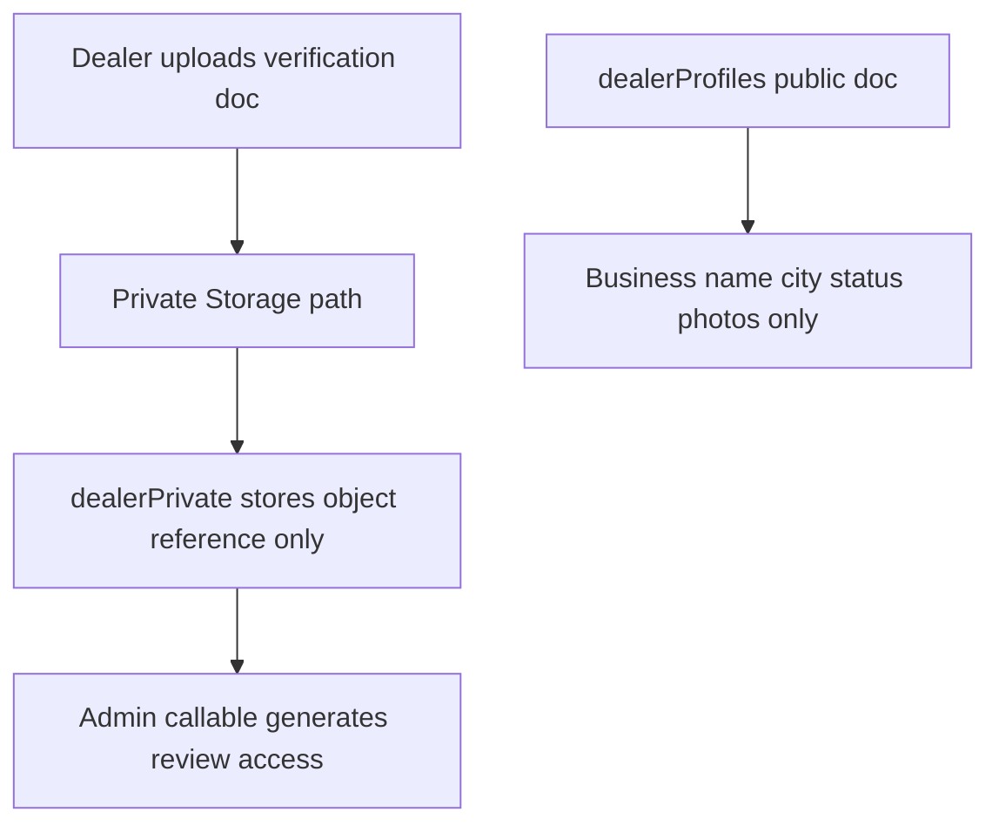

# Backend Hardening Before Billing

## Scope
This plan covers only:
- Move dealer verification document references out of public dealer data
- Turn on and enforce App Check
- Move quota/integrity-sensitive dealer actions into trusted Cloud Functions
- Add Firestore/Storage rules tests and Functions tests

This plan explicitly does **not** add a separate non-production Firebase project yet.

## Why This Order
1. Remove the current privacy leak first.
2. Add backend-owned writes before billing/limits become meaningful.
3. Add backend tests so rule/function changes are safe.
4. Enforce App Check once the code and tests are ready.

## Phase 1: Privatize Dealer Verification Documents
Use the existing private/public split pattern already present for `ownerCnic` and `soldHistory` in [c:/Users/Bbula/OneDrive/Documents/GitHub/Gari-Bazaar/firebase-client.js](c:/Users/Bbula/OneDrive/Documents/GitHub/Gari-Bazaar/firebase-client.js) and [c:/Users/Bbula/OneDrive/Documents/GitHub/Gari-Bazaar/firestore.rules](c:/Users/Bbula/OneDrive/Documents/GitHub/Gari-Bazaar/firestore.rules).

- Keep public-safe fields only in [c:/Users/Bbula/OneDrive/Documents/GitHub/Gari-Bazaar/dealerProfiles](c:/Users/Bbula/OneDrive/Documents/GitHub/Gari-Bazaar/dealerProfiles) shape as used by [c:/Users/Bbula/OneDrive/Documents/GitHub/Gari-Bazaar/marketplace-firestore.js](c:/Users/Bbula/OneDrive/Documents/GitHub/Gari-Bazaar/marketplace-firestore.js).
- Move verification document reference storage to private dealer data in [c:/Users/Bbula/OneDrive/Documents/GitHub/Gari-Bazaar/firebase-client.js](c:/Users/Bbula/OneDrive/Documents/GitHub/Gari-Bazaar/firebase-client.js), alongside `dealerPrivate/{uid}`.
- Change [c:/Users/Bbula/OneDrive/Documents/GitHub/Gari-Bazaar/register.html](c:/Users/Bbula/OneDrive/Documents/GitHub/Gari-Bazaar/register.html) so dealer onboarding and dealer change requests stop writing `registrationDocumentUrl` into public `dealerProfiles` or public-facing change payloads.
- Change [c:/Users/Bbula/OneDrive/Documents/GitHub/Gari-Bazaar/admin.html](c:/Users/Bbula/OneDrive/Documents/GitHub/Gari-Bazaar/admin.html) so approval flows no longer copy verification-document references back into public profile docs.
- Tighten [c:/Users/Bbula/OneDrive/Documents/GitHub/Gari-Bazaar/firestore.rules](c:/Users/Bbula/OneDrive/Documents/GitHub/Gari-Bazaar/firestore.rules) so public dealer docs explicitly reject `registrationDocumentUrl` and similar verification fields.
- Extend [c:/Users/Bbula/OneDrive/Documents/GitHub/Gari-Bazaar/scripts/migrate-dealer-private.mjs](c:/Users/Bbula/OneDrive/Documents/GitHub/Gari-Bazaar/scripts/migrate-dealer-private.mjs) to move any existing public verification-document references into private storage metadata and delete them from public docs.
- Decide admin access pattern:
  - preferred: admins request a short-lived URL from a new callable Function
  - acceptable fallback: allow admin read on verification Storage path in [c:/Users/Bbula/OneDrive/Documents/GitHub/Gari-Bazaar/storage.rules](c:/Users/Bbula/OneDrive/Documents/GitHub/Gari-Bazaar/storage.rules)

## Phase 2: Introduce Trusted Backend Actions For Dealer Limits And Integrity
Make backend code the source of truth for dealer limits and sensitive state transitions.

### Server-owned data model
- Keep `dealerProfiles` public-safe only.
- Move or add sensitive operational fields under private/admin-only docs, likely in `dealerPrivate/{uid}` first:
  - employees
  - verification document reference
  - entitlement snapshot or quota counters
  - future billing linkage fields
- Treat `plan` and `paymentStatus` as backend-owned state, not dealer-editable profile fields.

### First Cloud Functions to add or expand
In [c:/Users/Bbula/OneDrive/Documents/GitHub/Gari-Bazaar/functions/index.js](c:/Users/Bbula/OneDrive/Documents/GitHub/Gari-Bazaar/functions/index.js):
- Add a callable/admin-reviewed function for verification-doc access.
- Replace browser-authoritative listing writes from [c:/Users/Bbula/OneDrive/Documents/GitHub/Gari-Bazaar/dealer-dashboard.html](c:/Users/Bbula/OneDrive/Documents/GitHub/Gari-Bazaar/dealer-dashboard.html) with trusted functions for:
  - create listing
  - update listing
  - delete listing
  - assign listing contact/employee
  - mark sold
- Add a trusted function for saving dealer employees.
- Centralize entitlement rules in one backend helper so free/growth/pro logic is not duplicated across HTML pages.

### Entitlement checks to enforce server-side
Mirror current business intent in backend code instead of UI-only checks:
- free tier listing limit
- employee limit
- plan-based permissions
- verified/not-suspended dealer requirement
- valid assignee belongs to this dealer
- only backend can append sold history / increment `carsSold`

### Rules tightening after Functions exist
Update [c:/Users/Bbula/OneDrive/Documents/GitHub/Gari-Bazaar/firestore.rules](c:/Users/Bbula/OneDrive/Documents/GitHub/Gari-Bazaar/firestore.rules) so dealers can no longer directly cheat sensitive writes.

Priority rule changes:
- stop owner-written `dealerPrivate.soldHistory`
- stop owner-written `dealerProfiles.carsSold`
- stop dealer-editable `plan` / payment-like fields
- reduce direct listing writes once callable functions are in place
- prevent moderation-state bypasses where a dealer can force a listing back to `live`

## Phase 3: Add Backend Test Coverage Before Billing
Add backend safety tests before billing and webhooks land.

### Rules tests at repo root
Add root-level rules test harness around [c:/Users/Bbula/OneDrive/Documents/GitHub/Gari-Bazaar/firestore.rules](c:/Users/Bbula/OneDrive/Documents/GitHub/Gari-Bazaar/firestore.rules) and [c:/Users/Bbula/OneDrive/Documents/GitHub/Gari-Bazaar/storage.rules](c:/Users/Bbula/OneDrive/Documents/GitHub/Gari-Bazaar/storage.rules).

Likely files:
- [c:/Users/Bbula/OneDrive/Documents/GitHub/Gari-Bazaar/tests/firebase/firestore.rules.spec.js](c:/Users/Bbula/OneDrive/Documents/GitHub/Gari-Bazaar/tests/firebase/firestore.rules.spec.js)
- [c:/Users/Bbula/OneDrive/Documents/GitHub/Gari-Bazaar/tests/firebase/storage.rules.spec.js](c:/Users/Bbula/OneDrive/Documents/GitHub/Gari-Bazaar/tests/firebase/storage.rules.spec.js)
- [c:/Users/Bbula/OneDrive/Documents/GitHub/Gari-Bazaar/tests/firebase/helpers/testEnv.js](c:/Users/Bbula/OneDrive/Documents/GitHub/Gari-Bazaar/tests/firebase/helpers/testEnv.js)

Cover at least:
- public cannot read dealer-private data
- dealers cannot write admin-only/private fields
- dealers cannot exceed listing/employee limits through direct writes
- admins can review private verification docs
- buyers/dealers/admins each get only intended access

### Functions tests under `functions/`
Add a test harness for [c:/Users/Bbula/OneDrive/Documents/GitHub/Gari-Bazaar/functions/index.js](c:/Users/Bbula/OneDrive/Documents/GitHub/Gari-Bazaar/functions/index.js).

Likely files:
- [c:/Users/Bbula/OneDrive/Documents/GitHub/Gari-Bazaar/functions/test/markListingSold.spec.js](c:/Users/Bbula/OneDrive/Documents/GitHub/Gari-Bazaar/functions/test/markListingSold.spec.js)
- [c:/Users/Bbula/OneDrive/Documents/GitHub/Gari-Bazaar/functions/test/listingEntitlements.spec.js](c:/Users/Bbula/OneDrive/Documents/GitHub/Gari-Bazaar/functions/test/listingEntitlements.spec.js)
- [c:/Users/Bbula/OneDrive/Documents/GitHub/Gari-Bazaar/functions/test/adminVerificationAccess.spec.js](c:/Users/Bbula/OneDrive/Documents/GitHub/Gari-Bazaar/functions/test/adminVerificationAccess.spec.js)

Cover at least:
- unauthenticated calls rejected
- suspended/unverified dealer rejected
- free-tier over-limit rejected
- invalid employee assignment rejected
- sold-history/counter updates happen only via trusted function paths
- admin-only verification access enforced

### CI updates
Update [c:/Users/Bbula/OneDrive/Documents/GitHub/Gari-Bazaar/package.json](c:/Users/Bbula/OneDrive/Documents/GitHub/Gari-Bazaar/package.json), [c:/Users/Bbula/OneDrive/Documents/GitHub/Gari-Bazaar/functions/package.json](c:/Users/Bbula/OneDrive/Documents/GitHub/Gari-Bazaar/functions/package.json), and [c:/Users/Bbula/OneDrive/Documents/GitHub/Gari-Bazaar/.github/workflows/ci.yml](c:/Users/Bbula/OneDrive/Documents/GitHub/Gari-Bazaar/.github/workflows/ci.yml) so CI runs rules tests and functions tests in addition to current Playwright checks.

## Phase 4: Turn On And Enforce App Check
Because you chose full enforcement, treat this as a controlled rollout with one required console step that only you can do.

### Code changes
- Replace the empty App Check placeholder in [c:/Users/Bbula/OneDrive/Documents/GitHub/Gari-Bazaar/firebase-client.js](c:/Users/Bbula/OneDrive/Documents/GitHub/Gari-Bazaar/firebase-client.js) with real configuration flow for the web app.
- Ensure all pages importing the shared Firebase client initialize App Check before Firestore/Storage/Functions use.
- Add App Check protection to new callable functions in [c:/Users/Bbula/OneDrive/Documents/GitHub/Gari-Bazaar/functions/index.js](c:/Users/Bbula/OneDrive/Documents/GitHub/Gari-Bazaar/functions/index.js) so backend actions also require a valid app token.
- Remove or rework any client fallback that bypasses trusted function enforcement, especially in [c:/Users/Bbula/OneDrive/Documents/GitHub/Gari-Bazaar/dealer-dashboard.html](c:/Users/Bbula/OneDrive/Documents/GitHub/Gari-Bazaar/dealer-dashboard.html).

### Console-only steps you will need to do
- Register the web app under Firebase App Check
- Create the reCAPTCHA v3 key/site key
- Enable enforcement for the Firebase products we use

### Safe enforcement order
1. Ship code that sends App Check tokens
2. Verify browsing, login, uploads, dashboard actions, and admin actions still work
3. Enable enforcement on Firebase services
4. Re-run rules/functions/E2E checks after enforcement

## Delivery Strategy
Implement this in small increments instead of one large change:
1. private verification-doc references + migration
2. first trusted listing/sold/employee functions + corresponding rules tightening
3. backend test harness + CI
4. App Check wiring + enforcement

That order keeps the highest-risk privacy issue first and avoids turning on App Check before the app and tests are ready.